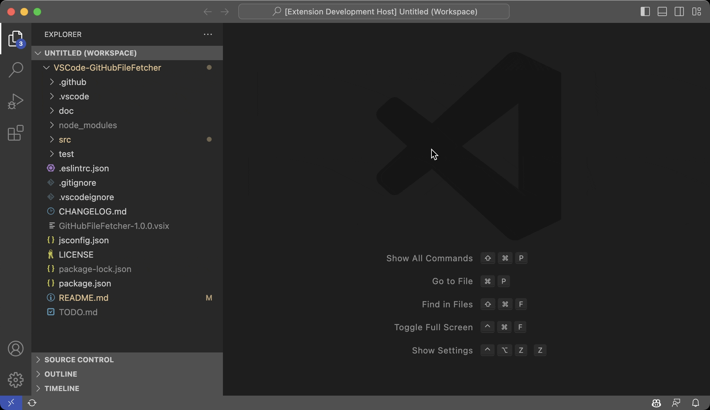
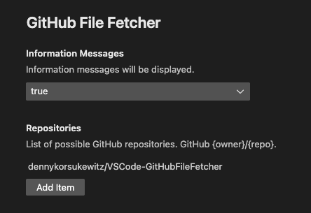

# GitHubFileFetcher

**GitHubFileFetcher** is an extension that searches and fetches files from GitHub.

| Repository | GitHub | Visual Studio Marketplace |
| ------ | ------ | ------ |
|  |   |   |
|  |   |  |
|   |  |   |
|   |  |   |

| Status |
 | ------ |
| [](https://github.com/dennykorsukewitz/VSCode-GitHubFileFetcher/compare/1.0.0...dev)   |

## Feature

The following steps are performed one after the other.

**1. GitHubFileFetcher (1/6):** Fetching GitHub repositories.

    This function allows you to search for GitHub owners or GitHub repositories.
    The search results (owner/repository) are then displayed.

**2. GitHubFileFetcher (2/6):** Fetching branches.

    After selecting the repository, all possible branches are displayed.

**3. GitHubFileFetcher (3/6):** Fetching files.

    After that, select the desired file.

**4. GitHubFileFetcher (4/6):** Fetching destination folder.

    Finally, the destination folder must be selected.

**5. GitHubFileFetcher (5/6):** Enter or change destination file path...

    Enter or change destination file path.

**6. GitHubFileFetcher (6/6):** Added file.

    `Hocus Pocus` - The file was created at the desired location.

**GitHubFileFetcher:** Should I save the new repository in the settings?

    So that you don't have to search for the repositories again and again,
    you can save the currently used one in the settings.

**Shortcut:** ```strg + alt + k, f```<br>
**Command:**  ```GitHubFileFetcher: Searches and fetches files from GitHub.```



### Settings

`Preferences -> Settings -> Extensions -> GitHubFileFetcher`

| Name | Description | Default Value |
| - | - | - |
| GitHubFileFetcher.informationMessages | Information messages will be displayed. | true |
| GitHubFileFetcher.repositories | List of possible GitHub repositories. GitHub {owner}/{repo}. | dennykorsukewitz/VSCode-GitHubFileFetcher |



---

## Installation

To install this extension, you have **three** options:

### 1. Search Extension in Marketplace

Search and install online extension via VSC extensions menu.

`Code` -> `Preferences` -> `Extensions` simply search for `GitHubFileFetcher` to install.

### 2. Install via vsix file

Download latest [vsix file](https://github.com/dennykorsukewitz/VSCode-GitHubFileFetcher/releases) and install via extensions menu.

`Code` -> `Preferences` -> `Extensions` -> `Views and More Action` -> `Install from VSIX`.

### 3. Source code

Download archive with the latest [release](https://github.com/dennykorsukewitz/VSCode-GitHubFileFetcher/releases) and unpack it to VisualStudioCode extensions folder
`$HOME/.vscode/extensions/`.

---

## Download

For download see [VSCode-GitHubFileFetcher](https://github.com/dennykorsukewitz/VSCode-GitHubFileFetcher/releases)

---

Enjoy!

Your [Denny Korsukéwitz](https://github.com/dennykorsukewitz) 🚀
