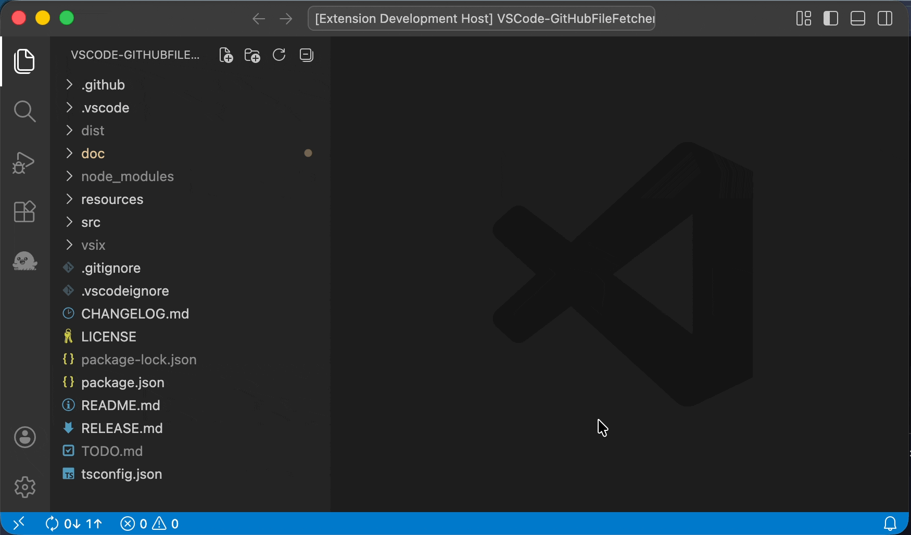
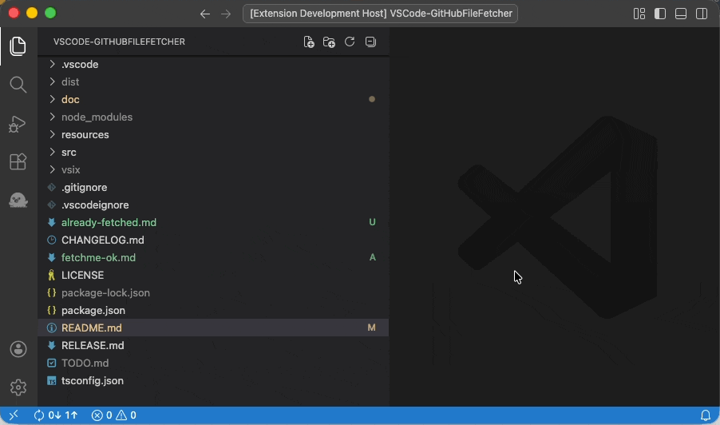
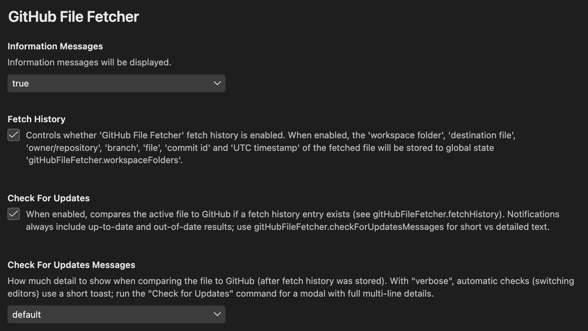
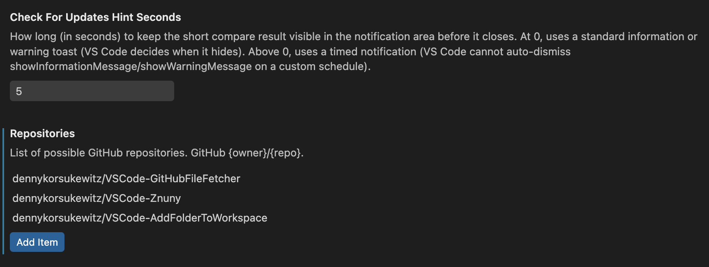
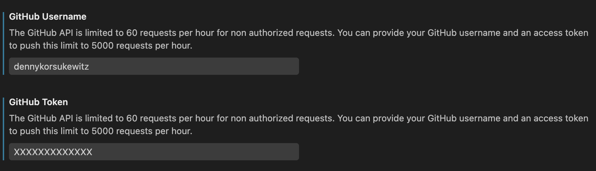

# GitHubFileFetcher

**GitHubFileFetcher** is an extension that searches and fetches files from GitHub.

GitHubFileFetcher is a powerful extension for Visual Studio Code that can help you save time and increase your productivity. With its simple and intuitive interface, you can easily search for files and repositories on GitHub without leaving your workspace. Whether you are a seasoned developer or just starting out, GitHubFileFetcher is an excellent tool to add to your Visual Studio Code arsenal.

`So, try it out and see how it can improve your workflow!`

|Repository|GitHub|Visual Studio Marketplace|
|----|----|----|
|| | |
|| ||
||| |
||| |

|Status|
|----|
|   |

## Feature

The following steps are performed one after the other.

**1. GitHubFileFetcher (1/6):** Fetching GitHub repositories.

    This function allows you to search for GitHub owners or GitHub repositories.
    The search results (owner/repository) are then displayed.

**2. GitHubFileFetcher (2/6):** Fetching branches.

    After selecting the repository, all possible branches are displayed.

**3. GitHubFileFetcher (3/6):** Fetching files.

    After that, select the desired file.

**4. GitHubFileFetcher (4/6):** Fetching destination workspace.

    Pick the **workspace folder** where the file should be written (Quick Pick placeholder: *Select destination workspace…*). You need a folder workspace open in Visual Studio Code.

**5. GitHubFileFetcher (5/6):** Enter or change destination file path...

    Path is relative to that workspace folder. If a file already exists there, a follow-up step asks whether to **overwrite** it (*GitHubFileFetcher (Overwrite)*); otherwise you can enter a different path.

**6. GitHubFileFetcher (6/6):** Added file.

    `Hocus Pocus` - The file was created at the desired location.
    The extension downloads the blob from GitHub, decodes it, and writes it to disk. Progress in the notification area uses the same step labels (1/6–6/6).

**GitHubFileFetcher (New Repository):** Should I save the new repository in the settings?

    After you discover a repository via **-- Search Owner --** or **-- Search Repository --** (not when you only pick an entry already in the list), you can append it to `gitHubFileFetcher.repositories` so it appears next time.
    So that you don't have to search for the repositories again and again.

**Keyboard shortcut (default):**

- **macOS:** `Option` + `Command` + `G` (`alt+cmd+g`) — **⌥⌘G**.
- **Windows / Linux:** `Alt` + `Shift` + `G` — there is no **Command** key; **Shift** avoids `Ctrl`+`Alt`+`G` matching **AltGr**+`G` ( **©** ) on many European layouts.

If a default collides with another extension or your OS, change it under **File → Preferences → Keyboard Shortcuts** by searching for `gitHubFileFetcher.run`.

**Command:** `GitHubFileFetcher: Searches and fetches files from GitHub.` (`gitHubFileFetcher.run`) — also available from the Command Palette (**View → Command Palette…**).

## Fetch History

When **GitHub File Fetcher: Fetch History** (`gitHubFileFetcher.fetchHistory`) is enabled (default), each successful fetch stores metadata: workspace folder, destination file path, owner/repository, branch, source file, commit ID, and a UTC timestamp.

- Open the **GitHub File Fetcher** icon in the **Activity Bar** and select the **Fetch History** view. The tree groups entries by workspace, then lists fetched files.
- Use **Add** in the view title to start the same fetch workflow as **GitHubFileFetcher: Searches and fetches files from GitHub.** (`gitHubFileFetcher.run`).
- Use **Refresh** in the view title to reload the tree after changes.
- Right-click a **file** row → **Remove File from Fetch History**; right-click a **workspace** row → **Remove Workspace from Fetch History**.

**Developer** commands (Command Palette, category **GitHubFileFetcher - (Developer)**): **Show Stored Fetch History** and **Clear Stored Fetch History**.

## Compare to GitHub (Check for updates)

When **GitHub File Fetcher: Check For Updates** (`gitHubFileFetcher.checkForUpdates`) is on and the active file matches a stored history entry, the extension can compare your local file to GitHub.

- Run **GitHubFileFetcher: Check for Updates** (`gitHubFileFetcher.checkForUpdates`) anytime.
- **GitHub File Fetcher: Check For Updates Messages** (`gitHubFileFetcher.checkForUpdatesMessages`): `default` for short notifications, `verbose` for a short toast on editor change plus a detailed modal when you run the command.
- **GitHub File Fetcher: Check For Updates Hint Seconds** (`gitHubFileFetcher.checkForUpdatesHintSeconds`): how long compare notifications stay visible (`0`–`120`; `0` lets Visual Studio Code use its default behaviour).

## Commands

|Title|Command ID|
|----|----|
|Searches and fetches files from GitHub.|`gitHubFileFetcher.run`|
|Check for Updates|`gitHubFileFetcher.checkForUpdates`|
|Show Stored Fetch History|`gitHubFileFetcher.fetchHistory.show`|
|Clear Stored Fetch History|`gitHubFileFetcher.fetchHistory.clear`|
|Add|`gitHubFileFetcher.fetchHistory.add`|
|Refresh|`gitHubFileFetcher.fetchHistory.refresh`|
|Remove File from Fetch History|`gitHubFileFetcher.fetchHistory.removeFile`|
|Remove Workspace from Fetch History|`gitHubFileFetcher.fetchHistory.removeWorkspace`|

The **Add**, **Refresh**, and **Remove …** commands are also available from the **Fetch History** view title and context menus.

## Settings

`Preferences → Settings → Extensions → GitHub File Fetcher`

|Setting|Type / values|Default|
|----|----|----|
|`gitHubFileFetcher.informationMessages`|string: `false` / `true` / `verbose`|`true`|
|`gitHubFileFetcher.fetchHistory`|boolean|`true`|
|`gitHubFileFetcher.checkForUpdates`|boolean|`true`|
|`gitHubFileFetcher.checkForUpdatesMessages`|string: `default` / `verbose`|`default`|
|`gitHubFileFetcher.checkForUpdatesHintSeconds`|number (`0`–`120`)|`5`|
|`gitHubFileFetcher.repositories`|array of `owner/repo` strings|`["dennykorsukewitz/VSCode-GitHubFileFetcher"]`|
|`gitHubFileFetcher.githubUsername`|string _(optional)_|_(empty)_|
|`gitHubFileFetcher.githubToken`|string _(optional)_|_(empty)_|

See each setting in Visual Studio Code for the full description and enum hints.

The GitHub API allows about 60 requests per hour without authentication; username and [personal access token](https://github.com/settings/tokens) raise the limit (see [rate limit](https://docs.github.com/en/rest/rate-limit/rate-limit)). Configure `gitHubFileFetcher.githubUsername` and `gitHubFileFetcher.githubToken` accordingly.

---

## Installation

To install this extension, you have **three** options:

### 1. Search Extension in Marketplace

Search and install the extension via the Visual Studio Code extensions view (**View → Extensions** or activity bar).
Search for **GitHubFileFetcher** or **GitHub File Fetcher**.

### 2. Install via vsix file

Download the latest [.vsix from Releases](https://github.com/dennykorsukewitz/VSCode-GitHubFileFetcher/releases). In Visual Studio Code: **Extensions** view → **···** (Views and More Actions) → **Install from VSIX…**.

### 3. Source code

Download archive with the latest [release](https://github.com/dennykorsukewitz/VSCode-GitHubFileFetcher/releases) and unpack it to Visual Studio Code extensions folder
`$HOME/.vscode/extensions/`.

---

## Download

For download see [VSCode-GitHubFileFetcher](https://github.com/dennykorsukewitz/VSCode-GitHubFileFetcher/releases)

---

Enjoy!

Your [Denny Korsukéwitz](https://github.com/dennykorsukewitz) 🚀
